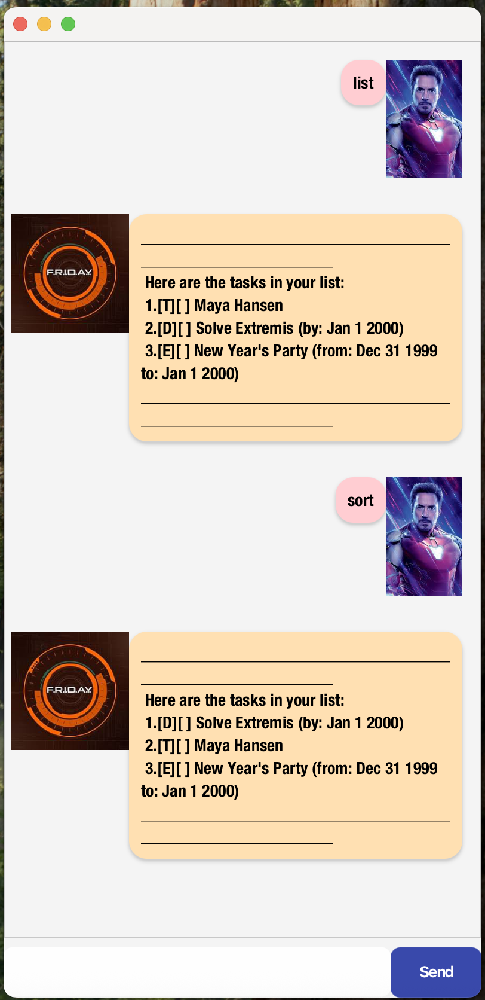

# Friday User Guide



## A rare look into Friday before its debut in The Avengers: Age of Ultron

Even Friday, Jarvis' successor, and arguably the second-most sophisticated 
chatbot, started out somewhere. After his death in 2019, as we searched 
through his belongings, we found a hard drive labelled 'Friday'. 
It was the inception of Friday: a chatbot that Tony would utilise to create 
and edit his to-do list. (Word has it that Tony once removed 1000 coding 
tasks in one day :o). These are the features that Friday had in this hard drive.

### Feature 1: Adding tasks

#### Types of tasks:
1. Todos
2. Deadlines
3. Events

#### Usage:
1. Todo: `todo <description>`
2. Deadline: `deadline <description> /by <DateTime>`
3. Event: `event <description> /from <DateTime> /to <DateTime>`
> The following are the acceptable DateTime formats: **"yyyy-MM-dd HHmm","yyyy-MM-dd","d/M/yyyy HHmm","d/M/yyyy"**

### Feature 2: Listing existing tasks

Usage: `list`

Example output:
``` 
Here are the tasks in your list: 
    1.[E][ ] New Year's Party (from: Dec 31 1999 to: Jan 1 2000)
    2.[D][ ] Solve Extremis (by: Jan 1 2000)
    3.[T][ ] Maya Hansen
```

### Feature 3: Deleting tasks

Usage: `delete <taskNumber>`

Example usage: `delete 2`
> Deletes task "2." from your `list`, shifts all tasks after it up by 1 index

### Feature 4: Mark/Unmark task as done

Usage:
* `mark <taskNumber>`
* `unmark <taskNumber>`

Example usage:
* `mark 2`
> Marks task "2." from your `list` as complete

* `unmark 2`
> Unmarks task "2." from your `list` as incomplete

### Feature 5: Find task

Usage: `find <keyword>`

Example usage: `find Extremis`
> Friday will output all tasks that contains the keyword "Extremis" <br>
> i.e. only task 2 from the above example

### Feature 6: sort

Example usage: `sort`
> Friday will sort all tasks in your list by their type (Deadline, Todo, Event)

Example output:

```markdown
1.[D][ ] Solve Extremis (by: Jan 1 2000)
2.[T][ ] Maya Hansen
3.[E][ ] New Year's Party (from: Dec 31 1999 to: Jan 1 2000)
```

### Feature 7: Exit app

Usage: `bye`
> This will exit the app!